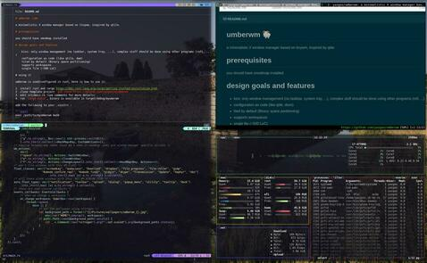

# umberwm :ram:

[](https://discord.gg/F684Y8rYwZ)

Minimalistic X window manager based on tinywm, inspired by qtile.



Video introduction [on LBRY](https://open.lbry.com/@goo:c/umberwm:e?r=FKWhS2Vay3CVr66qMZD98HdsLQ2LN7za) or [on youtube](https://youtu.be/5XdFNEq69N0).

# Prerequisites

You should have xmodmap installed.

You will need XCB bindings with the randr extension. On ubuntu you can install this with `sudo apt install libxcb-randr0-dev`.

# Design goals and features

  - Kiss: only window management (no taskbar, system tray, ...), complex stuff should be done using other programs (rofi, ...)
  - Configuration as code (like qtile, dwm, xmonad)
  - Tiled by default (Binary space partitioning)
  - Supports workspaces
  - Supports multiple displays
  - Single file (~1000 LoC)

# Using it

Umberwm is used/configured in rust, here is how to use it:

1. Install rust and cargo https://doc.rust-lang.org/cargo/getting-started/installation.html
2. Clone template project (__:warning: it is a different repository__): `git clone https://github.com/yazgoo/myumberwm`
3. Edit src/main.rs (see comments for more details)
4. Run `cargo build`, binary is available in target/debug/myumerwm

Add the following to your .xinitrc :

```shell
exec /path/to/myumberwm mod4
```

## hot reloading

Hot reloading allows to restart umberwm while keeping its state (i.e. keeping track of windows and their relative workspaces).
This is quite useful when you want to update your configuration.
You can add hot reload in your `.xinitrc` by running umberwm in a loop via:

```bash
while true; do
  echo starting umberwm...
  /path/to/umberwm mod4
  [ $? -ne 123 ] && break
done
```

in your `wm_actions`, add

```rust
("d".to_string(), Actions::SerializeAndQuit),
```

In this example, when pushing 'mod4 + d', umberwm will serialize a state under `.umberwm_state` and exit with return code `123`.
Then the `xinitrc` code will detect code `123`, causing a restart, umberwm will detect the serialized state, load it at startup and delete it.
